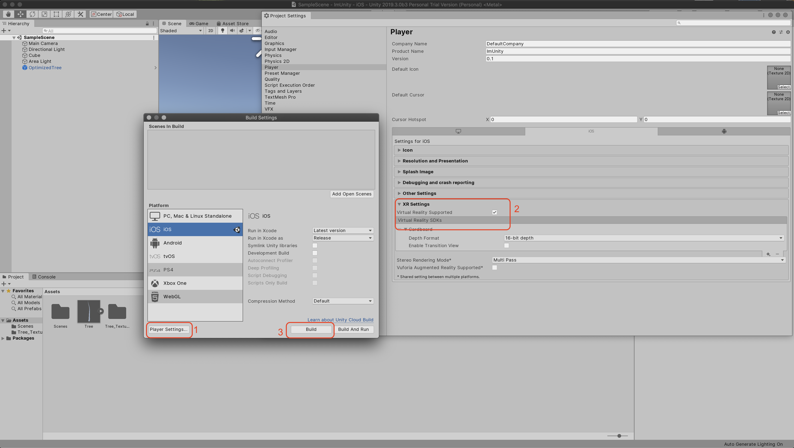
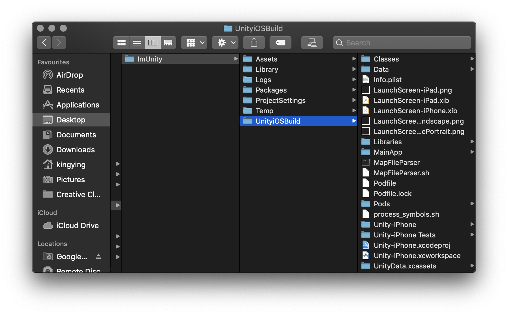
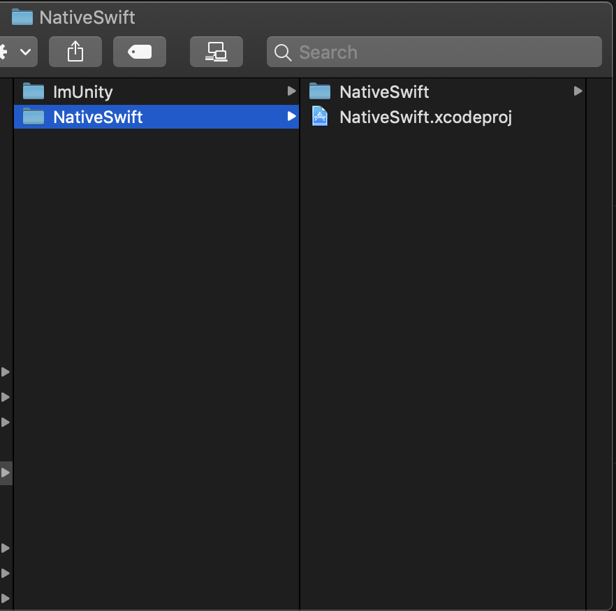
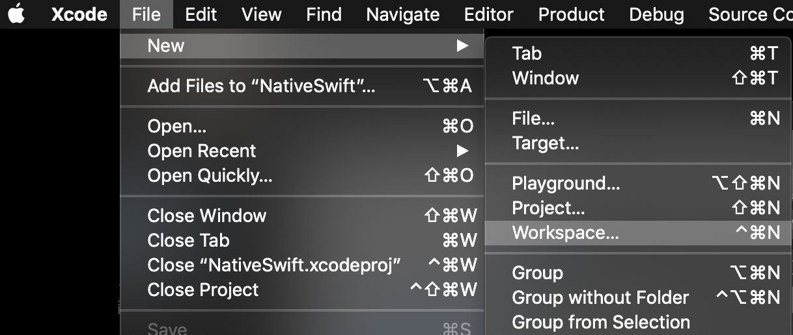
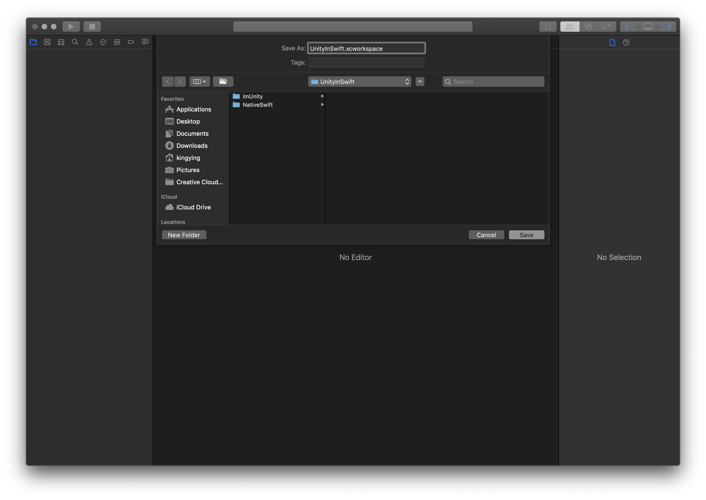
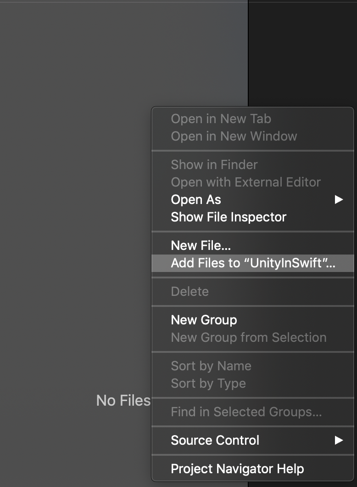
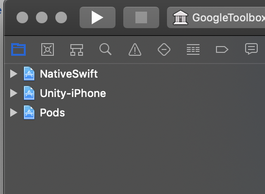
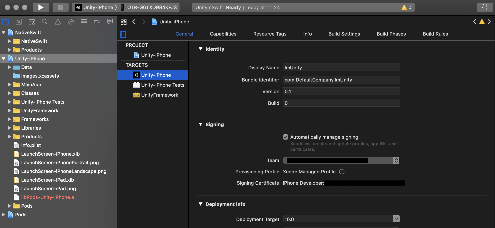
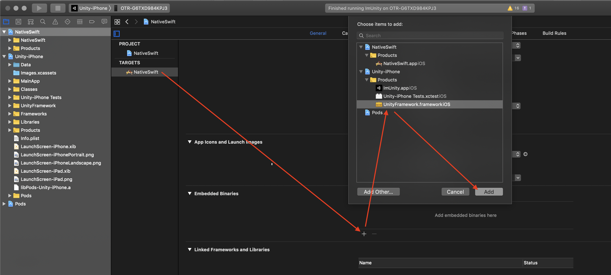
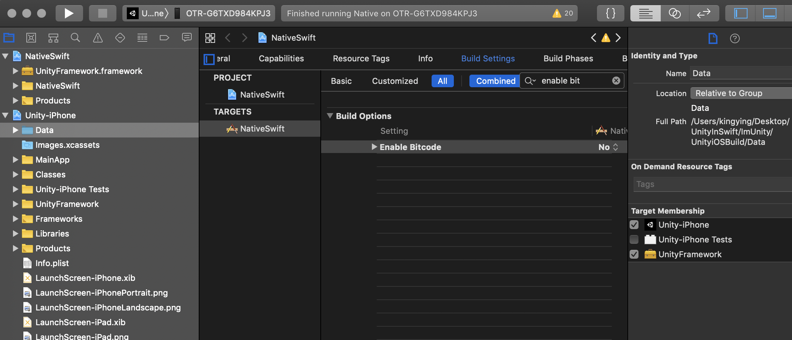

# Unity (with Pods support) in Natvie Swift
Tested on Xcode 10.3 (10G8) + Unity 2019.3.0b3 (Beta version)

### 1. Create Unity project
Create a new Unity project with Google Cardboard SDK support.
File -> Build Settings -> Select Platform (iOS) -> Switch Platform -> Player Settings
Make changes like below
 

Click "Build" and select a folder to save the output. It is better to put all projects under a same folder. For example:\
**UnityInSwift**\
-> **ImUnity** (All Unity files)\
-> **NativeSwift** (Native iOS Project)

### 2. Create a Workplace to include all projects
Create workplace named "UnityInSwift" and save to **UnityInSwift** folder\

Use Add Files to "UnityInSwift" to add all projects (Unity + Pods + Swift)\

And the result will looks like\

### 3. Test Run Unity
Select "Unity-iPhone" in TARGETS and setup the provisioning. And you should able to build&run it in Device.\ 

### 4. Include UnityFramework into Native Project
Add UntiyFramework to NativeSwfit project\
-> **Set "Bitcode" support to NO**\
-> **Include Unity-iPhone -> "Data" folder to UnityFramework**

### 5. Ref: AppDelegate.swift file for how to start the unity project.

### 6. DONE :)

